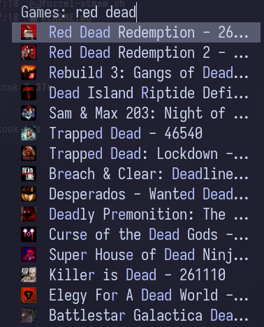

# fuzzel-steam-launcher

Launch Steam games from a `fuzzel` dmenu prompt.

The script fetches your owned Steam games, caches the response, builds a searchable `fuzzel` list, and launches the selected game with Steam.



## Requirements

- Bash
- `curl`
- `iconv`
- `jq`
- `fuzzel`
- `flatpak` (only when using Flatpak Steam)
- Steam client (native or Flatpak)
- ImageMagick (`magick` or `convert`) for local icon conversion

## Configuration

Do **not** hardcode your Steam API key or SteamID in the script. Provide them using either environment variables or a local `.env` file next to `fuzzel-steam.sh`.

- `STEAM_API_KEY`: your Steam Web API key from <https://steamcommunity.com/dev/apikey>
- `STEAM_ID64`: your SteamID64

A local `.env` file can look like this:

```sh
STEAM_API_KEY="your_api_key"
STEAM_ID64="00000000000000000"
```

`.env` is ignored by git, so keep your real values there and do not commit it.

The launcher automatically uses the native `steam` command when available, or the
Flatpak app `com.valvesoftware.Steam` otherwise. It also checks the corresponding
Steam data directory when marking installed games and loading icons.

## Usage

With `.env` configured:

```sh
./fuzzel-steam.sh
```

Force-refresh the cached Steam games response before opening `fuzzel`:

```sh
./fuzzel-steam.sh --refresh
```

Or as a one-off command:

```sh
STEAM_API_KEY="your_api_key" STEAM_ID64="00000008000000000" ./fuzzel-steam.sh
```

## Cache

Data is cached under `${XDG_CACHE_HOME:-$HOME/.cache}/fuzzel-steam-launcher` and refreshed when the cached games file is older than seven days. Use `--refresh` to update the cache immediately.
